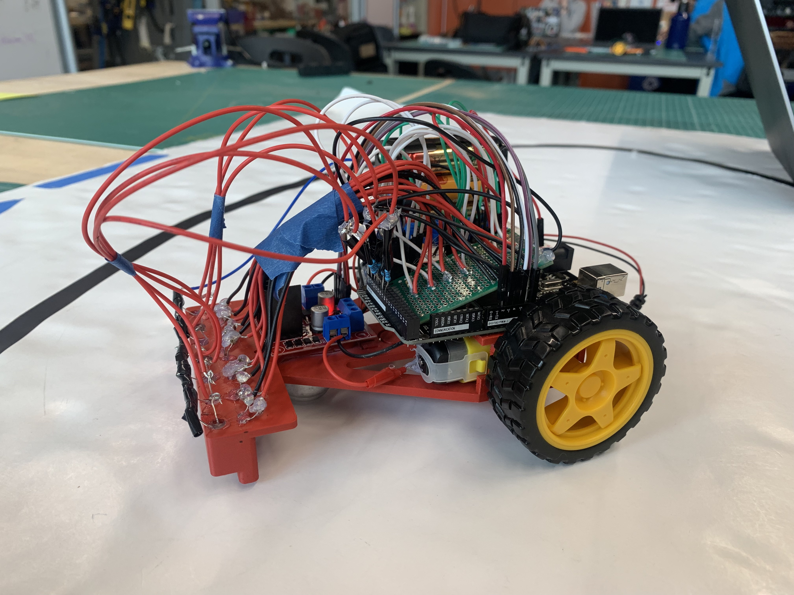

## ECE LAB 4

Potentiometers & Photoresistors Circuits

# Assembled Robot

# Robot Following Line

# <ins>Competition Day!</ins>

# Annotated Final Picture

# Explanation of PID control

Our kP multiplier was 1.25, our kI was left at default, and our kD was 10. After testing, we determined that these values worked well and that a lot of derivative gain was needed to dampen overshoot. It was mostly trial and error. For the frequency sweep, kP was increased and speed was decreased so the robot could make tight turns. The loop had similar tuning, except the speed was a little higher. For the drag race, the speed was maximum, kP was decreased, and kD was increased to avoid oscillation. 

# Frequency Sweep

<video src="https://user-images.githubusercontent.com/126359456/226070180-9dd40859-a438-4ed5-b01d-64993f7dc49c.mp4" controls="controls" style="max-width: 730px;">
</video>

<video src="https://user-images.githubusercontent.com/126359456/226070675-2a877769-b52d-4101-af54-5631585131a9.mp4" controls="controls" style="max-width: 730px;">
</video>

# Circuit Track

<video src="https://user-images.githubusercontent.com/126359456/226070400-01f0ed60-f700-49e4-8630-7d07df9316c7.mp4" controls="controls" style="max-width: 730px;">
</video>

# Drag Race

<video src="https://user-images.githubusercontent.com/126359456/226069871-134a0518-dd51-4152-b834-98166fad6d2d.mov" controls="controls" style="max-width: 730px;">
</video>

# Team Photo

